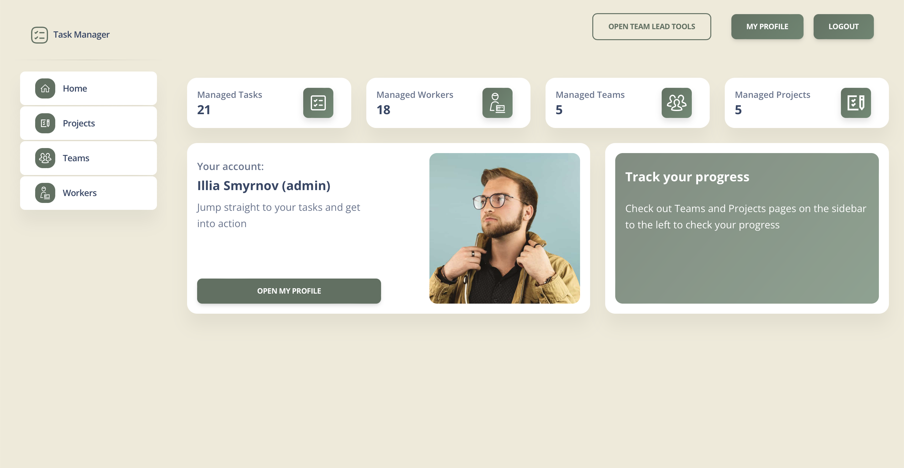

# Company Task Manager

A simple Task manager that allows to track progress of projects.

## Check it out

[Company Task Manager deployed to Render](https://company-task-manger.onrender.com)


## Installation

Python3 should be already installed

```shell
git clone https://github.com/ilushasm/company_task_manager.git
cd  company_task_manager
python3 -m venv venv
source venv/bin/activate
pip install -r requirements.txt
python manage.py runserver # Starts Django server
```

## Features
* Support teams assigment to projects
* Task assigment to specific team-member
* Projects' progress and task tracking
* Employees' task tracking

## Demo




You can use user's below to access the app:

Basic Group user:
```shell
username: basic_user
password: user12345
```
Team Lead Group user:
```shell
username: tl_user
password: user12345
```
